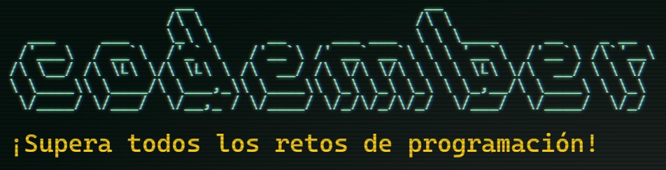

Todos los retos de programación de Codember en Python. Creador del proyecto: [midudev](https://twitter.com/midudev)

|2022|Reto|Solución|
|----|----|----|
|1|[¡Arregla Twitter!](2022/challenge01.py)|

$ submit
156@giroz
|
|2|[¡Atrapa a esos ciber criminales!](2022/challenge02.py)|

$ submit
thanks for playing codember please share
|
|3|[La zebra de colores](2022/challenge03.py)|

$ submit
30@red
|
|4|[Encuentra la contraseña de tu amigo](2022/challenge04.py)|

$ submit
165-23555
|
|5|[Battle Royale de frameworks y bibliotecas](2022/challenge05.py)|

$ submit
Diana-100
|

|2023|Reto|Solución|
|----|----|----|
|1|[El reto](2023/challenge_01.py)|

$ submit
murcielago15leon15jirafa15cebra6elefante15rinoceronte15hipopotamo15ardilla15mapache15zorro15lobo15oso15puma2jaguar14tigre10leopardo10gato12perro12caballo14vaca14toro14cerdo14oveja14cabra14gallina10pato10ganso10pavo10paloma10halcon11aguila11buho11colibri9canario8loro8tucan8pinguino7flamenco7
|
|2|[Mini Compiler Challenge](2023/challenge_02.py)|

$ submit
024899455
|
|3|[El Desafío del Cifrado Espía](2023/challenge_03.py)|

$ submit
bgamidqewtbus 
|
|4|[Hackers dañan sistema de lista_archivos](2023/challenge_04.py)|

$ submit
O2hrQ 
|
